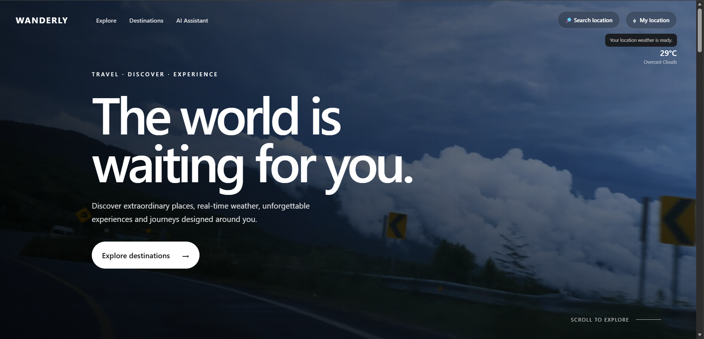
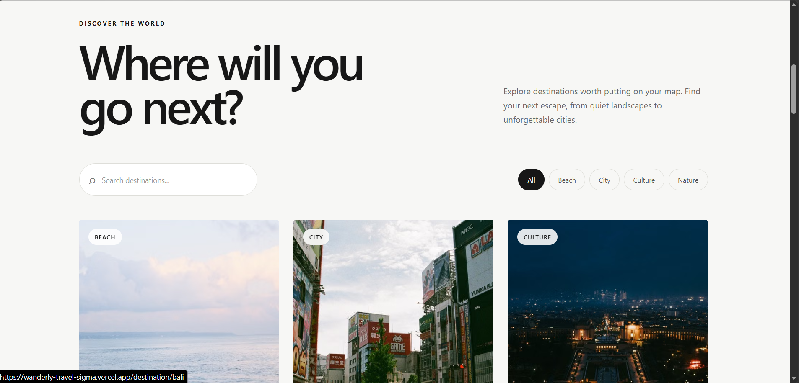
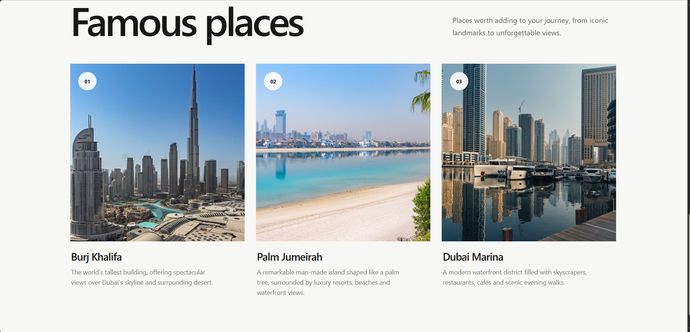
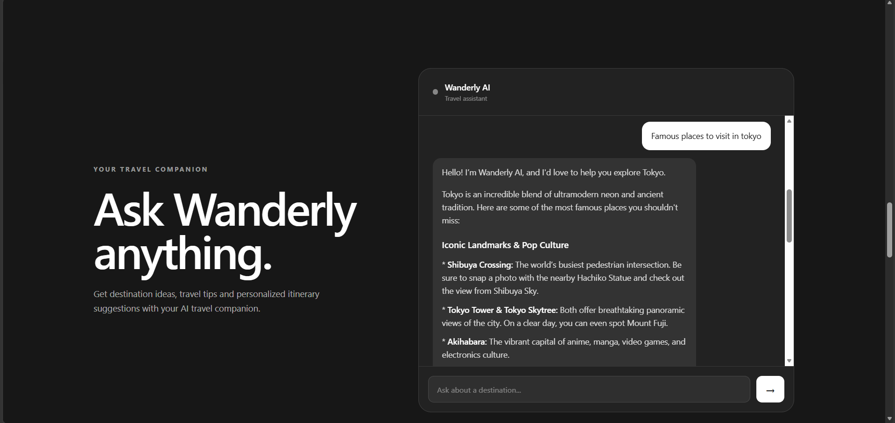
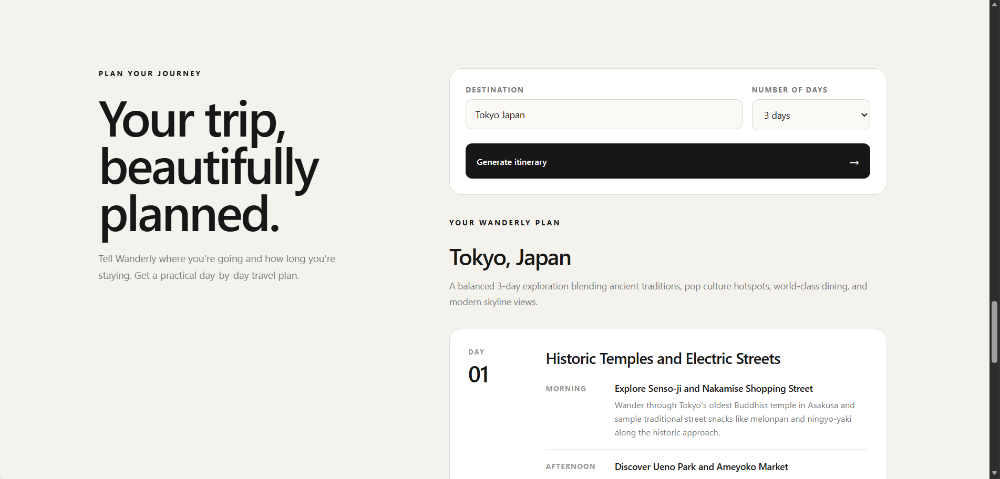

# Wanderly — Travel Discovery App

> A modern, responsive travel discovery experience built with React, combining destination exploration, real-time weather, dynamic imagery, AI travel assistance, and personalized itinerary generation.

## 🌍 Live Demo

**Live Website:**  
https://wanderly-travel-sigma.vercel.app/

**GitHub Repository:**  
https://github.com/Sujay0076/wanderly-travel

------------------------------------------------------------------------

## ✨ Overview

Wanderly is a travel discovery web application designed to make trip
planning simple, visual, and interactive.

Users can explore destinations, search and filter places, view
destination details, check current weather, use their browser location
or manually search for a location, ask an AI travel assistant for
recommendations, and generate a structured day-by-day itinerary.

The project focuses strongly on visual design, smooth interaction,
responsive layouts, accessibility, and practical API integration.

------------------------------------------------------------------------

## 🚀 Features

### Destination Explorer

-   Browse curated travel destinations
-   Search destinations by name or country
-   Filter destinations by category
-   Categories include Beach, City, Culture, and Nature
-   Dynamic destination photography loaded from Pexels
-   Responsive destination card layout

### Destination Details

-   Dedicated page for each destination
-   Dynamic destination hero imagery
-   Destination overview and description
-   Famous places to visit
-   Dynamic images for famous places
-   Real-time weather information

### Location Awareness

-   Browser geolocation support
-   Weather based on the user's current coordinates
-   Manual location search
-   Multiple location search results
-   Clear success, loading, and error states
-   Handles denied or unavailable browser location

### Real-Time Weather

-   Current temperature
-   Weather condition
-   Feels-like temperature
-   Humidity
-   Wind speed
-   Atmospheric pressure
-   Weather icon

### Wanderly AI

-   AI-powered travel assistant
-   Destination recommendations
-   Travel tips
-   Famous places
-   Activities and experiences
-   Food and culture suggestions
-   Formatted responses with headings, lists, and emphasis
-   Loading/thinking indicator
-   Error handling

### AI Itinerary Generator

-   Choose a destination
-   Select trip duration
-   Generate a practical itinerary
-   Structured day-by-day presentation
-   Morning, afternoon, and evening activities
-   Trip summary
-   Handles AI response formatting and fallback parsing

### Responsive Design

-   Desktop layout
-   Tablet layout
-   Mobile layout
-   Responsive navigation
-   Responsive destination grids
-   Mobile-friendly forms and controls

### Accessibility

-   Semantic HTML structure
-   Form labels
-   Accessible input descriptions
-   Status and error announcements
-   Keyboard-friendly controls
-   Visible `:focus-visible` states
-   Descriptive image alt text

------------------------------------------------------------------------

## 🛠️ Tech Stack

  Technology        Purpose
  ----------------- ----------------------------------------------
  React             Front-end UI
  Vite              Development and production build tooling
  JavaScript        Application logic
  CSS               Responsive visual design
  React Router      Client-side routing
  Lucide React      UI icons
  OpenWeather API   Weather and location data
  Pexels API        Dynamic destination and place images
  Gemini API        AI travel assistant and itinerary generation
  Vercel            Deployment

------------------------------------------------------------------------

## 🔌 API Integrations

### OpenWeather API

OpenWeather is used for:

-   Current weather data
-   Browser-location weather
-   Manual location search through the geocoding API

### Pexels API

Pexels is used to dynamically load:

-   Destination images
-   Famous-place images

No destination photography is hardcoded into the destination data.

### Gemini API

Gemini powers:

-   Wanderly AI travel conversations
-   Destination recommendations
-   Travel suggestions
-   AI-generated itineraries

The application requests structured itinerary data and includes
client-side parsing to handle supported AI response formats.

------------------------------------------------------------------------

## 📸 Screenshots

### Hero / Landing Page



### Destination Explorer



### Destination Details & Weather


### Famous Places



### Wanderly AI Assistant



### AI Itinerary Generator



------------------------------------------------------------------------

## 📁 Project Structure

``` text
wanderly-travel/
├── public/
│   └── video/
│       └── hero.mp4
│
├── screenshots/
│   ├── hero.png
│   ├── destination-explorer.png
│   ├── destination-details-weather.png
│   ├── famous-places.png
│   ├── ai-assistant.png
│   └── itinerary.png
│
├── src/
│   ├── components/
│   │   ├── AIAssistant.jsx
│   │   ├── DestinationCard.jsx
│   │   ├── DestinationExplorer.jsx
│   │   ├── DestinationGrid.jsx
│   │   ├── FamousPlaces.jsx
│   │   ├── Hero.jsx
│   │   ├── ItineraryGenerator.jsx
│   │   ├── Navbar.jsx
│   │   └── WeatherCard.jsx
│   │
│   ├── data/
│   │   └── destinations.js
│   │
│   ├── pages/
│   │   ├── DestinationDetails.jsx
│   │   └── Home.jsx
│   │
│   ├── services/
│   │   ├── geminiService.js
│   │   ├── imageService.js
│   │   ├── locationService.js
│   │   └── weatherServices.js
│   │
│   ├── App.jsx
│   ├── App.css
│   ├── index.css
│   └── main.jsx
│
├── .gitignore
├── package.json
├── package-lock.json
├── vite.config.js
└── README.md
```

------------------------------------------------------------------------

## ⚙️ Getting Started

### Prerequisites

Make sure you have installed:

-   Node.js
-   npm
-   Git

### 1. Clone the repository

``` bash
git clone https://github.com/Sujay0076/wanderly-travel.git
```

### 2. Open the project

``` bash
cd wanderly-travel
```

### 3. Install dependencies

``` bash
npm install
```

### 4. Configure environment variables

Create a `.env` file in the project root:

``` env
VITE_OPENWEATHER_API_KEY=your_openweather_api_key
VITE_PEXELS_API_KEY=your_pexels_api_key
VITE_GEMINI_API_KEY=your_gemini_api_key
```

Replace the placeholder values with your own API keys.

### 5. Start the development server

``` bash
npm run dev
```

Vite will provide a local development URL in the terminal.

### 6. Create a production build

``` bash
npm run build
```

------------------------------------------------------------------------

## 🔐 Environment Variables & Security

The application uses environment variables for external API credentials.

Required variables:

``` text
VITE_OPENWEATHER_API_KEY
VITE_PEXELS_API_KEY
VITE_GEMINI_API_KEY
```

The `.env` file is excluded from Git using `.gitignore`.

**Never commit API keys or other secrets to the repository.**

For production applications, sensitive API integrations should ideally
be proxied through a secure backend or serverless API rather than
exposing provider credentials in a client-side application.

------------------------------------------------------------------------

## ☁️ Deployment

The application is deployed using Vercel.

The production build is generated with:

``` bash
npm run build
```

The required environment variables are configured in the Vercel project
settings.

### Live Application

https://wanderly-travel-sigma.vercel.app/

------------------------------------------------------------------------

## 🎨 Design & UX

Wanderly uses an editorial-inspired travel aesthetic with:

-   Large expressive typography
-   Cinematic hero imagery
-   Generous whitespace
-   Rounded interactive controls
-   Minimal color palette
-   Responsive layouts
-   Smooth scrolling
-   Hover and focus interactions
-   Clear loading and error feedback

The design was created with a strong emphasis on visual presentation and
usability across desktop, tablet, and mobile devices.

------------------------------------------------------------------------

## 🧪 Build Verification

The production build was successfully verified using:

``` bash
npm run build
```

The Vite production build completed successfully before deployment.

------------------------------------------------------------------------

## 🖼️ Image Credits

Destination and famous-place photography is dynamically sourced from
Pexels.

Pexels: https://www.pexels.com/

------------------------------------------------------------------------

## 📌 Project Context

Wanderly was developed as a Front-End Developer assessment project with
an emphasis on:

-   React development
-   API integration
-   Responsive design
-   Visual design
-   Interaction and motion
-   Accessibility
-   Error and loading states
-   AI-assisted travel experiences
-   Clean project organization

------------------------------------------------------------------------

## 👨‍💻 Author

**Sujay Yatham**

GitHub: https://github.com/Sujay0076
